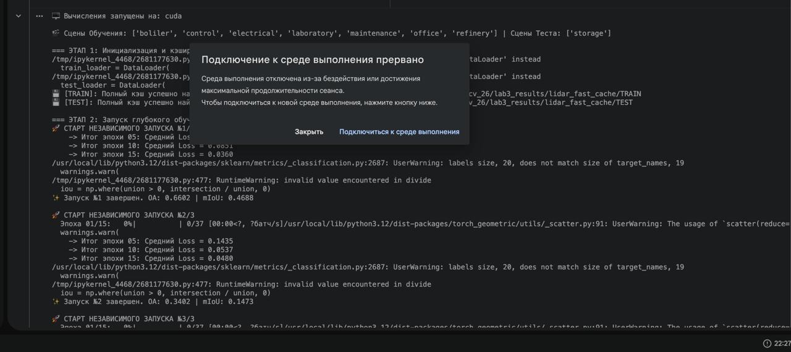

### Лабораторная работа 3

В папке представлено 2 ipynb-ноутбука: первый выполнен с моделью PointNet, которая дала сомнительный результат (резуьлтаты по метрикам в конце ноутбука), второй — с моделью PointNet++, которая достигла промежуточных результатов в OA: 0.6602 и mIoU: 0.4688 и которую не удалось доучить до конца из-за ограничений colab. Скриншот в подтверждение — ниже.

