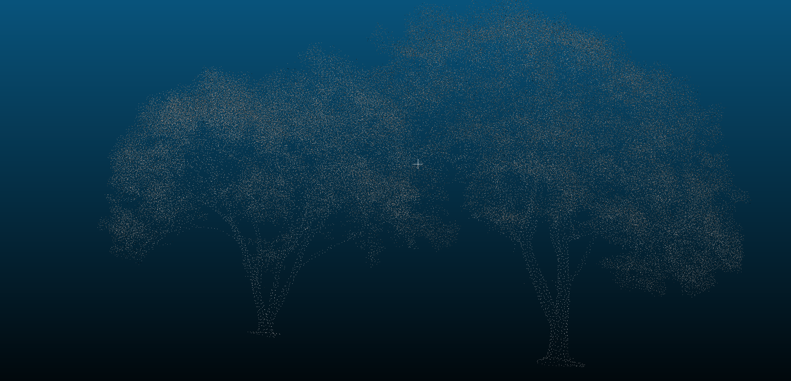

# Анализ результатов субсэмплинга облака точек

Исходное облако точек: **1 962 539 точек**
Объект: **скан деревьев**
Источник: sketchfab.com/3d-models/tree-point-cloud-fa710195d48541478eedac7967d99d34

---

## Сравнение методов субсэмплинга

| Метод                      | Параметры        | Точек после | Уменьшение | Визуальное качество                               |
| -------------------------- | ---------------- | ----------: | ---------: | ------------------------------------------------- |
| **Random**                 | Keep ~25%        | **490 634** |       ~75% | Потеря равномерности, ухудшение детализации кроны |
| **Spatial (Min Distance)** | min space = 0.1  | **101 265** |     ~94.8% | Сильная потеря тонких структур (ветки)            |
| **Octree**                 | Subdiv level = 8 | **279 573** |     ~85.7% | Лучшее сохранение формы и распределения           |

---

## Ответы на вопросы

**1 Какой метод дал наилучший визуальный результат?**
**Octree Subsampling** — сохраняет структуру кроны и равномерность точек после уменьшения облака.

**2 Как изменяется точность геометрии?**

* Random — искажает плотность, детали исчезают случайно
* Spatial — геометрия грубо упрощается, пропадают тонкие ветви
* Octree — оптимальный баланс: хорошее качество при заметном уменьшении данных

**3 Какой способ самый быстрый?**
**Random** — самый быстрый алгоритм без сложных вычислений

**4 Какие параметры оптимальны?**
Octree: *Subdiv level = 8*
Хорошо сохраняет форму объекта при значительном уменьшении облака

---

## Визуализация результатов

| Исходные данные                | Random Subsampling         | Spatial Subsampling          | Octree Subsampling         |
| ------------------------------ | -------------------------- | ---------------------------- | -------------------------- |
|  |  |  |  |

---

## Итоговые выводы

* **Octree** — лучший компромисс между качеством и уменьшением данных
* **Random** — быстрый, но ухудшает равномерность распределения точек
* **Spatial** — слишком грубо снижает детализацию, подходит только для сильного сокращения плотности
