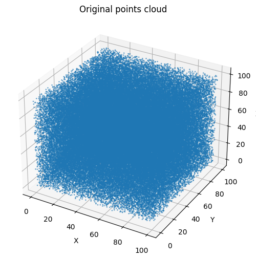
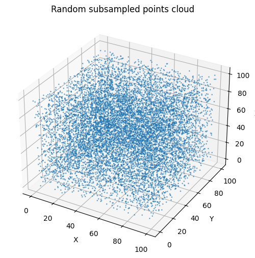
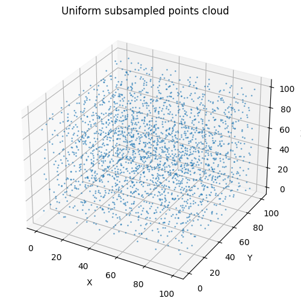
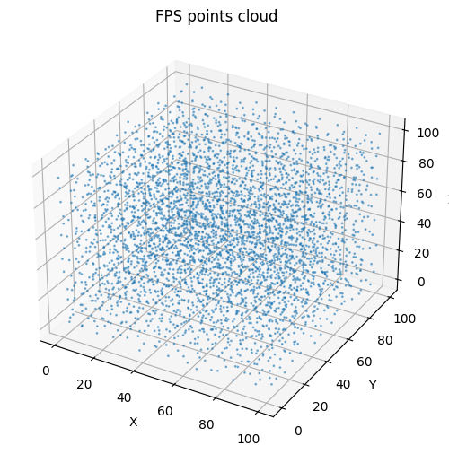

# Subsampling Point Clouds: Random, Voxel Grid и FPS

## Визуализация результатов

| Исходные данные            | Случайная выборка      | Voxel Grid           | FPS             |
| -------------------------- | ---------------------- | -------------------- | --------------- |
|  |  |  |  |

---

## Вводные данные

Тест выполнен на облаке точек размером **100000 × 3**.
Замеры времени (`time.time()`):

| Метод                         | Время выполнения (с) |
| ----------------------------- | -------------------- |
| Случайная выборка             | **0.0074067**        |
| Voxel Grid Subsampling        | **0.3260353**        |
| Farthest Point Sampling (FPS) | **11.2356956**       |

---

## Ответы на вопросы

### 1️⃣ Как влияет размер выборки на визуальное качество облака?

Чем больше точек сохраняется, тем точнее и плавнее передаётся форма объекта.
Если точек слишком мало, облако выглядит разреженным и теряет мелкие детали.

---

### 2️⃣ Как влияет размер вокселя в `voxel_grid_subsampling` на детализацию?

При увеличении размера вокселя выбрасывается больше точек, и теряется детализация.
Маленькие воксели лучше сохраняют форму, но почти не уменьшают облако.

---

### 3️⃣ Какой метод эффективнее по времени?

**Random > Voxel > FPS** по скорости выполнения.

Случайная выборка — практически мгновенная.
Voxel Grid — компромисс скорости и качества.
FPS — наиболее вычислительно затратный метод.

---

### 4️⃣ Какой метод лучше сохраняет геометрию объекта?

FPS обеспечивает наиболее равномерное распределение точек и лучше сохраняет форму.
Voxel Grid упрощает структуру, но удерживает основные поверхности.
Случайная выборка может смещать плотность и искажать геометрию.

---
