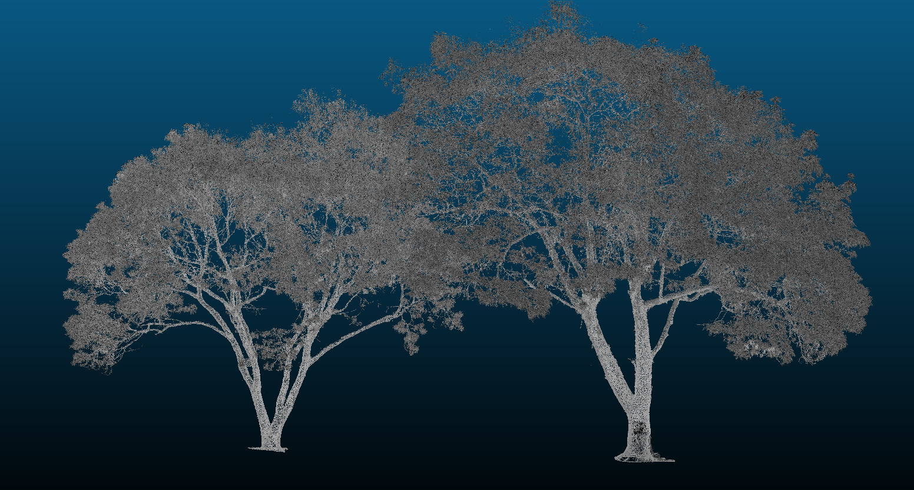
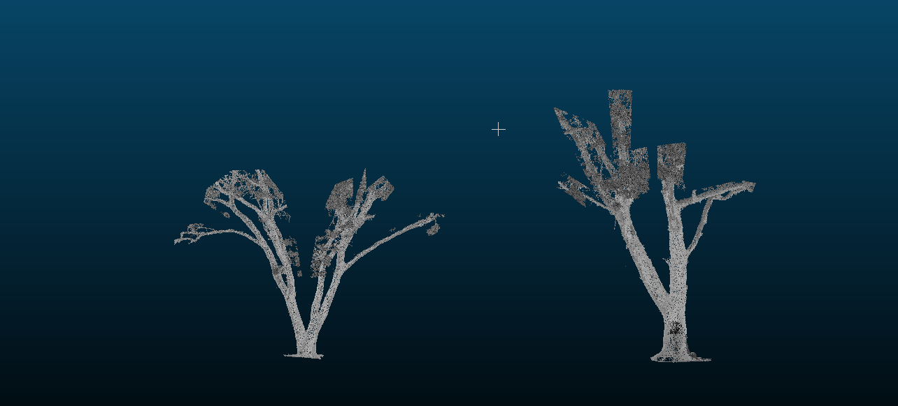
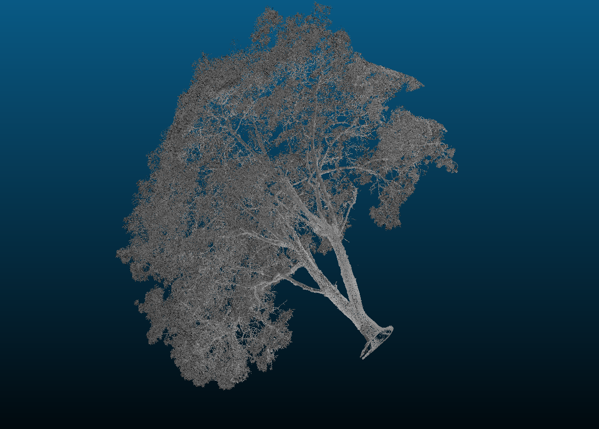
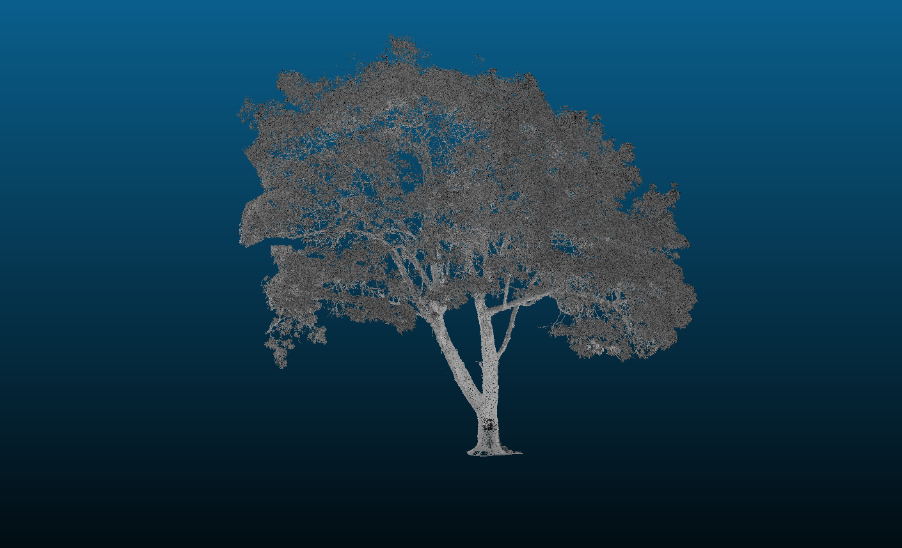

## Сегментация облака точек

### Входные данные

Для экспериментов использовалось облако точек, представляющее два дерева (скан природного объекта).

🔗 **Ссылка на исходный файл облака точек:**
**(будет добавлено)**

---

### Скриншоты до и после сегментации

| Сцена                            | Описание                                        |                  Изображение                  |
| -------------------------------- | ----------------------------------------------- | :-------------------------------------------: |
| Исходное облако                  | Два дерева в исходном виде                      |                 |
| Сегментация стволов              | Выделены и сохранены только стволы деревьев     |                     |
| Вид справа, выделено одно дерево | Удалено второе дерево для анализа структуры     |  |
| Левое дерево                     | Отдельно левое дерево      |                         |
| Правое дерево                    | Отдельно правое дерево |                       |

---

### Краткий текстовый отчёт

**1 Какой метод использовался?**
Для сегментации применялся инструмент **Polygon Selection / Segment** в CloudCompare. Замыкание полигона выполнялось правой кнопкой мыши.

**3 В каких случаях инструмент Segment работает лучше, чем автоматические методы?**
Он особенно полезен при сложной геометрии и плотном переплетении объектов, где автоматические алгоритмы не способны корректно разделить сцены.

**3 Недостатки ручной сегментации**
Она требует времени, зависит от оператора и плохо масштабируется на большие облака.

**4 Что происходит с атрибутами точек?**
Все атрибуты исходных точек (цвет, интенсивность, координаты) сохраняются в новых сегментах.

**5 Практическое применение сегментации**

* Выделение отдельных элементов архитектуры
* Анализ растительности и состояния леса
* Археологические исследования объектов на фоне рельефа
* Подготовка данных для цифровых моделей местности (DTM/DSM)

---

## Вывод

Ручная сегментация позволяет достичь высокой точности выделения отдельных объектов, особенно при наличии сложной структуры, как у кроны деревьев. Метод Segment в CloudCompare оказался удобным и эффективным для отделения левого и правого деревьев и анализа их в отдельности.
