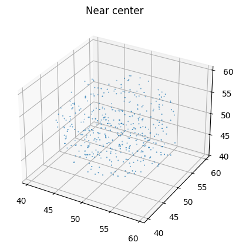

# Выделение областей в облаке точек с помощью NumPy

Ниже представлены три способа выделения областей из облака точек размером **100000 × 3**.
Для каждого способа приведена визуализация и краткий анализ результатов.

---

## 1. Фильтрация по координатным границам (BBox)

**Условие:**
[
x \in [20,50],\quad y \in [30,70],\quad z \in [10,40]
]

**Что выделено:**
Прямоугольный параллелепипед внутри исходного объёма — именно те точки, которые находятся в заданных трёхмерных диапазонах. Это даёт чёткую, ограниченную область.

**Количество точек:**

* Исходное облако: **100 000**
* После BBox фильтра: **3 641**

---

## 2. Фильтрация по высоте (High Points)

**Условие:**
[
z > 80
]

**Что выделено:**
Верхний горизонтальный слой облака точек. Выбираются все точки, расположенные выше заданного уровня по оси Z.

**Количество точек:**

* Исходное облако: **100 000**
* Точки выше Z > 80: **20 094**

---

## 3. Фильтрация по расстоянию до точки (Near Center)

**Условие:**
Точки в радиусе ( R ) от центра
[
C = (50,; 50,; 50)
]

**Что выделено:**
Небольшая локальная окрестность вокруг указанного центра. Геометрически это сферическая область, в проекции — компактное «скопление» точек.

**Количество точек:**

* Исходное облако: **100 000**
* Точек в радиусе от центра: **420**

---

## Итоговые выводы

* **BBox-фильтрация** выделяет чётко ограниченную область с предсказуемыми размерами — удобно для анализа конкретного участка пространства.
* **Фильтрация по высоте** захватывает крупный слой точек и хорошо подходит для анализа верхних/нижних уровней или сегментации по Z.
* **Фильтрация по расстоянию до точки** формирует компактную локальную выборку и полезна для задач поиска соседей или анализа структуры вокруг определённой точки.

Количество выбранных точек сильно зависит от метода: от **420** (локальная сфера) до **20 094** (высотный фильтр), что показывает различия в масштабе выделяемых областей.
