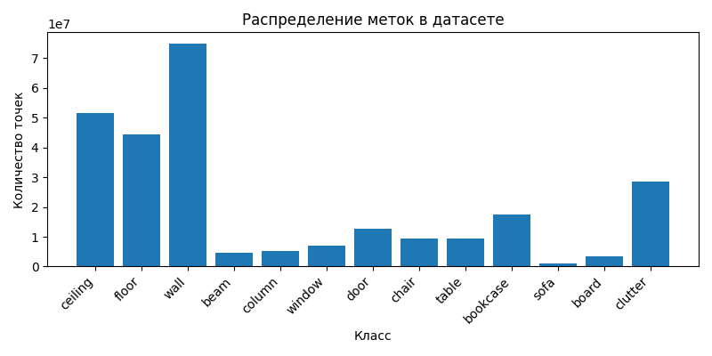

## Файл s3dis_dataset.npy, гистограмма и первые 5 строк массива

### s3dis_dataset.npy
Поскольку s3dis_dataset.npy вышел в 7 ГБ, а git lfs позволяет в базовой версии загружать не более 1 ГБ, было решено загрузить на Яндекс.Диск.
Ссылка: disk.yandex.ru/d/TzryHaLO-nToPQ

### Гистограмма распределения по классам

### Первые 5 строк итогового массива

 [[-0.6087635   2.402594    1.8447402   0.45490196  0.43529412  0.35686275   4.        ]
 [-0.6087635   2.4022195   1.8447402   0.46666667  0.44705883  0.36862746    4.        ]
 [-0.60854846  2.4017515   1.951453    0.654902    0.6666667   0.6           4.        ]
 [-0.6087635   2.4046533   1.8587025   0.4509804   0.43137255  0.3529412     4.        ]
 [-0.608656    2.4027812   1.9045792   0.654902    0.6627451   0.5803922     4.        ]]
